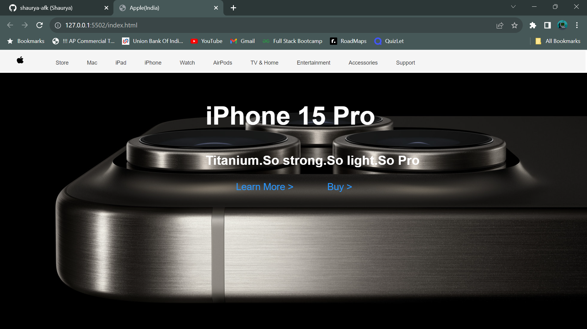

# Apple Front-End Clone

Welcome to the Apple Front-End Clone repository! This project is a faithful recreation of the Apple official website's front-end. It serves as a demonstration of front-end development skills and does not include any backend functionality or real data.

## Live Demo

You can check out a live demo of this Apple Front-End Clone .

## Features

- **Homepage**: About the new iPhone 15's launch.
- **More of Apple**: The navbar to explore more of apple's products.

## Technologies Used

- HTML5
- CSS3

Thanks for checking out!! 😊
